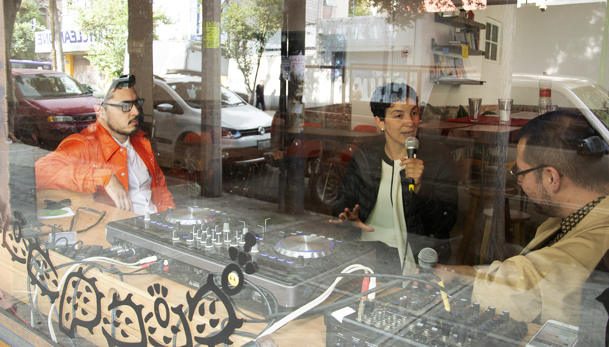

# Radio Nopal



Radio Nopal es una estación de radio colectiva por internet, localizada en la colonia San Rafael de la Ciudad de México.

https://radionopal.com/

### Desarrollo

Desarrollado con create-react-app

```sh
$ npm install
$ npm start
```

Abre [http://localhost:3000](http://localhost:3000) para ver el sitio en el explorador.
